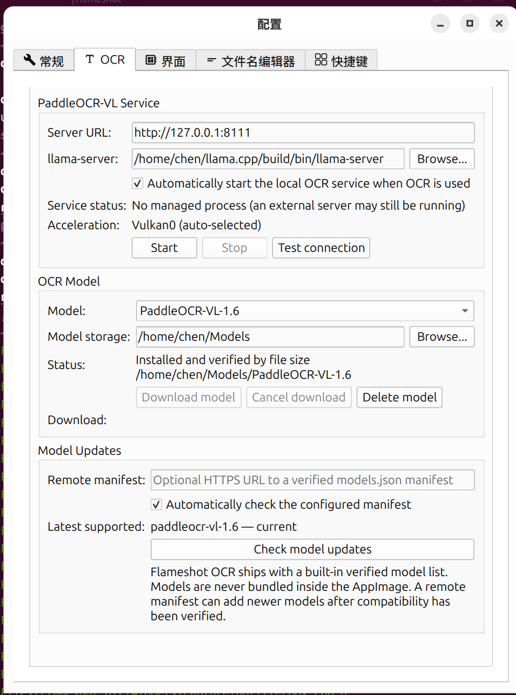

# Flameshot OCR


**Flameshot OCR** is an experimental Linux fork of [Flameshot](https://github.com/flameshot-org/flameshot) that adds fully local OCR powered by **PaddleOCR-VL-1.6** through **llama.cpp**.

By default, screenshots are sent only to a local `llama-server` endpoint on `127.0.0.1` unless the user explicitly changes the server URL.

> This repository is an independent fork and is not an official Flameshot release.

## Download

Latest stable release:

**[Flameshot OCR v2.4](https://github.com/yanjing-chen/flameshot-ocr/releases/tag/v2.4)**

Available packages:

- `Flameshot-OCR-2.4-x86_64.AppImage`
- `flameshot-ocr_2.4_amd64.deb`
- SHA-256 checksum files for both packages

### AppImage

```bash
chmod +x Flameshot-OCR-2.4-x86_64.AppImage
./Flameshot-OCR-2.4-x86_64.AppImage
```

### Debian / Ubuntu

```bash
sudo apt install ./flameshot-ocr_2.4_amd64.deb
```

The `.deb` package conflicts with/replaces the official `flameshot` package because both install the same executable and desktop integration.

## What v2.4 adds

### OCR

- OCR button directly inside the Flameshot capture toolbar.
- PaddleOCR-VL-1.6 GGUF support.
- One-click model download with progress reporting.
- Download cancel/resume using `.part` files and HTTP Range requests.
- Model integrity checks.
- Model deletion and model-path management.
- Persistent local `llama-server` lifecycle.
- Automatic server startup and reuse between captures.
- Manual start/stop controls.
- PID ownership protection.
- Local connection testing.
- Verified remote `models.json` support with local caching.
- Simplified Chinese OCR settings.
- Wayland-compatible capture workflow.

### Hardware acceleration

- CPU inference.
- Vulkan inference.
- Dedicated NVIDIA CUDA inference.
- Automatic and manual device selection.
- NVIDIA CUDA preferred over NVIDIA Vulkan when the managed CUDA runtime is installed.
- AMD and Intel GPUs supported through Vulkan where compatible.

### CUDA Runtime Manager

v2.4 introduces a dedicated NVIDIA CUDA runtime manager.

Features include:

- CUDA runtime installation directly from the OCR settings.
- Resume support for interrupted downloads.
- SHA-256 verification.
- Archive-size verification.
- Required-file verification.
- Versioned runtime installation.
- Atomic `current` runtime switching.
- Previous-runtime tracking.
- CUDA device probing before activation.
- Real model self-test after installation.
- Automatic rollback when an upgrade fails.
- Remote runtime update checks.
- Dynamic download and installed-size display.

Current CUDA runtime:

```text
CUDA runtime: 12.8-r2
CUDA Toolkit: 12.8.1
```

Compiled GPU targets:

```text
sm75    RTX 20 series
sm86    RTX 30 series
sm89    RTX 40 series
sm120a  RTX 50 series
```

An `sm120a` PTX fallback is also included.

The CUDA runtime is distributed separately from the AppImage/deb package, so AMD, Intel and CPU-only users do not need to download the NVIDIA runtime.

## Tested configurations

### AMD / Vulkan

Successfully tested with:

- Ubuntu Linux
- GNOME 50
- Wayland
- AMD Ryzen 7 8845HS
- Radeon 780M
- Mesa RADV Vulkan
- 32 GB RAM
- PaddleOCR-VL-1.6 GGUF
- llama.cpp Vulkan runtime

### NVIDIA / CUDA

Real OCR inference has been tested with:

- NVIDIA GeForce RTX 3050 Laptop GPU
- CUDA architecture `sm86`
- NVIDIA driver with CUDA driver support
- CUDA 12.8-r2 multi-architecture runtime
- PaddleOCR-VL-1.6 GGUF

The `sm75`, `sm89` and `sm120a` targets are included in the CUDA build, but have not yet all been validated on physical RTX 20/40/50 hardware.

## Screenshot



## OCR model

The current built-in verified model is PaddleOCR-VL-1.6:

- `PaddleOCR-VL-1.6-GGUF.gguf`
- `PaddleOCR-VL-1.6-GGUF-mmproj.gguf`

The OCR model itself is **not bundled** into the AppImage or `.deb`.

Default model storage:

```text
~/.local/share/flameshot-ocr/models/
```

A previous development installation under:

```text
~/Models/PaddleOCR-VL-1.6/
```

is also detected.

## Using OCR

1. Start Flameshot.
2. Open **Configuration → OCR**.
3. Confirm that the OCR model is installed. If not, download it from the OCR settings.
4. Leave automatic local OCR service startup enabled if desired.
5. Start a Flameshot GUI capture.
6. Select an area containing text.
7. Click the OCR toolbar button or use your configured OCR shortcut.
8. Copy or edit the recognized text from the OCR result interface.

Flameshot OCR does not require a fixed OCR shortcut. Existing user shortcut configuration is preserved.

## Runtime selection

The application, OCR model and inference runtime are managed separately.

Typical automatic priority:

```text
explicit user-configured llama-server
        ↓
NVIDIA CUDA
        ↓
NVIDIA Vulkan
        ↓
AMD / Intel Vulkan
        ↓
CPU
```

### NVIDIA CUDA

NVIDIA users can install the managed CUDA runtime directly from the OCR settings.

Runtime files are stored under:

```text
~/.local/share/flameshot-ocr/runtime/cuda/
```

The versioned layout uses links such as:

```text
current  -> active runtime
previous -> previous known-good runtime
```

A working NVIDIA driver is required. A system-wide CUDA toolkit is not required when using the managed runtime.

### Vulkan

The standard Linux package includes a llama.cpp Vulkan runtime.

Modern AMD GPUs using Mesa/RADV should normally be detected automatically.

NVIDIA Vulkan can also be used with a compatible NVIDIA driver.

### CPU

A CPU runtime is included as the final fallback.

## CUDA runtime updates

CUDA runtime metadata is distributed through a dedicated runtime manifest.

The application can:

- check the latest supported runtime,
- compare it with the installed version,
- download and verify it,
- validate required files,
- probe CUDA devices,
- run a real OCR-model self-test,
- activate the new runtime only after validation,
- automatically return to the previous working runtime when validation fails.

Current public runtime:

```text
12.8-r2 (RTX 20/30/40/50)
```

The previous `12.8-r1` runtime remains available for compatibility and fallback purposes.

## Remote model manifest

Flameshot OCR supports a verified remote `models.json` manifest for model metadata and updates.

The application can cache a valid manifest locally. If the remote endpoint is temporarily unavailable or invalid, the last valid cache can remain available.

An advanced user may configure a custom manifest URL in the OCR settings.

## GitHub Actions

`.github/workflows/build.yml` builds Linux packages on supported pushes, tags and manual workflow runs.

Application artifacts:

- `Flameshot-OCR-<version>-x86_64.AppImage`
- `flameshot-ocr_<version>_amd64.deb`
- SHA-256 checksum files

A separate workflow builds the multi-architecture CUDA runtime.

GitHub Actions artifacts are temporary build outputs. Published application packages and CUDA runtimes are distributed as GitHub Release assets.

## Development

This fork is based on the Flameshot source tree and uses CMake / Qt 6.

Typical local build:

```bash
cmake -S . -B build -DCMAKE_BUILD_TYPE=Release
cmake --build build -j"$(nproc)"
```

Run:

```bash
./build/src/flameshot gui
```

## Project status

Current stable release:

```text
Flameshot OCR v2.4
```

v2.4 has been manually tested for:

- OCR on Wayland.
- PaddleOCR-VL-1.6 inference.
- Persistent OCR service and reuse.
- Model download and interrupted-download resume.
- Model deletion.
- Remote model manifest handling.
- Vulkan runtime selection.
- CUDA runtime installation and update detection.
- CUDA SHA-256 verification.
- CUDA device probing.
- CUDA OCR self-test.
- Successful CUDA runtime upgrade.
- Failed-upgrade rollback.
- Real CUDA OCR inference on an RTX 3050 Laptop GPU.

## Credits and licenses

- Flameshot: upstream project and original source base.
- PaddleOCR-VL-1.6 GGUF: PaddlePaddle.
- llama.cpp: local GGUF inference runtime.
- OCR icon: Material Design Icons / Pictogrammers Team, Apache 2.0.

See [`THIRD_PARTY_NOTICES.md`](THIRD_PARTY_NOTICES.md) and the existing project `LICENSE`.

---

## 中文说明

Flameshot OCR 是一个基于 Flameshot 的非官方 Linux 分支，在截图工具中集成本地 OCR。

当前正式版本为 **v2.4**。

主要功能：

- PaddleOCR-VL-1.6 本地 OCR
- Wayland 截图 OCR
- CPU / Vulkan / NVIDIA CUDA 推理
- 模型下载与管理
- 本地 llama.cpp OCR 服务
- CUDA Runtime Manager
- CUDA 运行环境下载、SHA-256 校验和真实模型自检
- CUDA 运行环境在线更新
- 更新失败自动回退
- RTX 20 / 30 / 40 / 50 多架构 CUDA runtime

OCR 模型不打包进 AppImage 或 deb，用户可以在 OCR 设置页单独下载。

NVIDIA CUDA runtime 同样与主程序分开发行，NVIDIA 用户可以从 OCR 设置页直接安装。

v2.4 已在 AMD Radeon 780M Vulkan 环境以及 NVIDIA GeForce RTX 3050 Laptop CUDA 环境完成实际 OCR 测试。

GitHub Actions 自动生成 AppImage、Ubuntu/Debian 安装包以及 CUDA runtime 构建产物。
